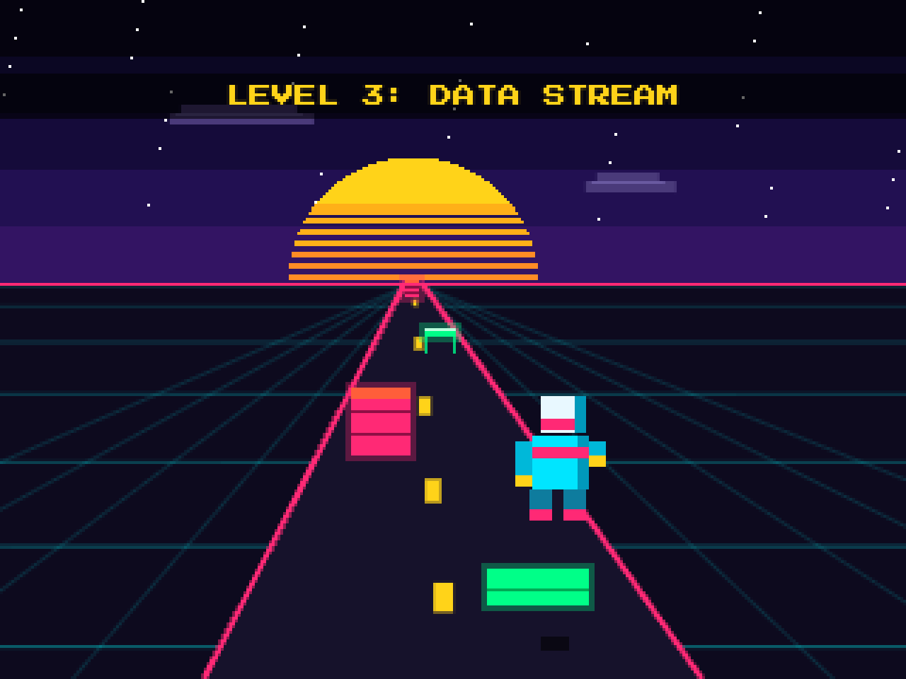

# Neon Sense

[](https://github.com/Naveed233/Neon-Sense-Deep-learning-/actions/workflows/ci.yml)
[](LICENSE)

An endless runner you steer with your head. Tilt left or right to change lanes, duck under bars, blink to jump over barriers.

Instead of hard-coded thresholds on head angle, the game trains a small neural network on the player during a short calibration step, then classifies their gestures live. Face tracking, training and inference all run in the browser. There is no backend and the webcam feed never leaves the page.

**[Play it in the browser](https://naveed233.github.io/Neon-Sense-Deep-learning-/)** (Chrome recommended). No webcam? There is a keyboard/touch mode.



## How it works

1. **Landmarks.** [MediaPipe Face Landmarker](https://ai.google.dev/edge/mediapipe/solutions/vision/face_landmarker) returns 478 face landmarks per camera frame.
2. **Features.** Each frame is reduced to 18 numbers: eight key points (eye corners, chin, forehead) measured from the nose and divided by face width, plus the opening of each eye. Because of that normalisation, the features don't change when you move around the frame or sit closer to the camera (there are tests for this).
3. **Calibration.** The player holds each pose (idle, left, right, duck, jump) for 40 frames. After each pose the classifier is retrained: a TensorFlow.js network with two hidden layers (16 and 8 units) and a softmax over the five gestures, trained on standardised features. Retraining takes about 0.3 s.
4. **Inference.** During play every new camera frame is classified. Predictions under 70% confidence are ignored, which stops noisy frames from moving the runner. The HUD shows the current prediction and its confidence.
5. **Adaptive difficulty.** A controller estimates skill from reaction time (how long it takes to get clear of an obstacle once it's in range, smoothed with an exponential moving average) and the current dodge streak. That estimate sets obstacle speed and spawn rate. Crashing lowers it, and it carries over between retries.

A small pixel runner on the calibration screen copies whatever the model currently predicts, so you can check the calibration before starting.

## Running locally

The browser only allows camera access on `https://` or `localhost`, so open the game through a local server rather than as a file:

```
git clone https://github.com/Naveed233/Neon-Sense-Deep-learning-.git
cd Neon-Sense-Deep-learning-
python3 -m http.server 8000
```

Then open http://localhost:8000. Any static server works (`npx serve`, for example). There is no build step.

TensorFlow.js and MediaPipe are loaded from jsDelivr, so the first load needs a network connection.

## Controls

| Action | Webcam | Keyboard | Touch |
| --- | --- | --- | --- |
| Change lane | Tilt head | Left / Right, A / D | Swipe left / right |
| Jump (low barriers) | Blink | Up, W, Space | Swipe up or tap |
| Duck (overhead bars) | Duck | Down, S | Swipe down |

Pink walls need a lane change.

## Development

```
npm install
npm test       # unit tests (node:test)
npm run lint   # ESLint
```

CI runs both on every push.

```
index.html          page structure
css/style.css
js/
  main.js           wiring and the frame loop
  config.js         gestures, levels, thresholds
  tracker.js        webcam + MediaPipe (loaded on demand)
  features.js       landmark features and standardisation
  classifier.js     TensorFlow.js gesture model
  calibration.js    calibration screen
  difficulty.js     adaptive difficulty
  game.js           game state, physics, collisions
  renderer.js       pixel-art drawing, shared by game and calibration
  input.js          keyboard and touch controls
  audio.js          synthesised sound effects
tests/              unit tests for features, difficulty and game logic
```

## Design notes

- **A model per player.** A general gesture model would have to cope with every face, camera angle and lighting setup. A model trained on 200 frames of one person in one room has a much easier job, and that's why a network this small is enough.
- **CPU backend for TensorFlow.js.** The network is tiny, so running it on the GPU mostly costs a readback every frame. The CPU backend classifies a frame in about 0.04 ms and leaves the GPU to MediaPipe.
- **Detection only on new camera frames.** The camera delivers about 30 frames per second while the display may refresh at 60 or 120 Hz. Detection runs only when the video frame changes.
- **Frame-rate independent physics.** All movement is scaled by elapsed time, and collisions check whether an obstacle crossed the player's position during the step rather than whether it is inside a range, so fast obstacles can't skip through.
- **Low internal resolution.** The game renders at 320x240 and is scaled up with nearest-neighbour filtering. That keeps drawing cheap and gives the pixel-art look.

## Limitations

- Gesture accuracy depends on lighting and on how distinct the recorded poses are. Re-recording a pose adds more samples rather than replacing them.
- The calibration isn't saved between page loads.
- MediaPipe's GPU delegate is most reliable in Chromium-based browsers; the game falls back to CPU if it fails.

## Background

The idea came out of a Vibe Coders Tokyo event at Google's Shibuya office, themed around Gemma and running models locally. A conversation there about self-driving systems that adapt through deep learning made me want to try the same idea at a much smaller scale: a game that learns its player instead of shipping fixed rules. Thanks to the organisers and to the presenters, Ju-yeong Ji and Alastair Tse.

## License

[MIT](LICENSE)
